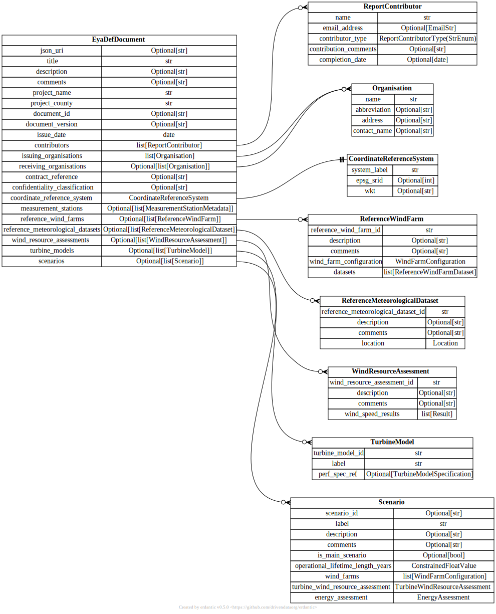

# The IEC 61400-15-2 EYA DEF

The `eya_def` repo provides a digital format for exchange of information
on wind plant energy yield assessment reporting as defined by the
IEC 61400-15-2 standard. For more information regarding the IEC 61400-15
working group, please see the progress update presentation
[here](https://zenodo.org/record/3952717).

## JSON Schema and examples

The `eya_def` takes the form of a [JSON Schema](
json_schema/iec_61400-15-2_eya_def.schema.json).

Examples of JSON document files that implement (comply with) the JSON
Schema are found [here](json_schema/examples).

## Schema diagrams

The top levels of the current draft of the data model is illustrated
below.

  

The python package (see [below](#Python-package)) uses [erdantic](
https://erdantic.drivendata.org/stable/) to generate graphical
representations of the data model.

The website [Draw.io](https://draw.io) can also be used to visualise
data tables. See https://www.diagrams.net/blog/single-repository-diagrams
for info about GitHub and draw.io functionality.

## Python package

This repo includes the python package `eya_def_tools` for working with
the EYA DEF data model. This package is located [here](eya_def_tools)
and has a separate README located [here](eya_def_tools/README.md).

## Pre-commit hooks

The [pre-commit](https://pre-commit.com/) package is used for managing  
git hooks. This is part of the python package development dependencies
and is installed automatically during the `eya_def_tools` package
development installation (when using the `[dev]` option). You can check
it has been installed successfully by executing the following.

```bash
pre-commit --version
```

The project configurations for the git hooks are contained within the
file `.pre-commit-config.yaml` at the root repository directory.

Lint checks are run on both `git commit` and `git push`. Tests are
not included in the git hooks.

To install `pre-commit` in your local repository for the 'pre-commit'
and 'pre-push' stages, execute the following from the root of the git
repository in an environment where all dependencies are installed.

```bash
pre-commit install --hook-type pre-commit --hook-type pre-push
```

After installation, `pre-commit` will run automatically on `git commit`
and `git push`. Note that some hooks related to formatting (e.g.
`requirements-txt-fixer` and `trailing-whitespace`) will auto-fix files
but return an error on doing so. In these cases the fixed files need to
be staged again and the commit attempt repeated. It should then pass the
second time.

If you want to run `pre-commit` manually on all files in the repository,
including all the hooks, execute the following command.

```bash
pre-commit run --all-files --hook-stage push
```

The `pre-commit` hook dependencies can be updated by executing the
following.

```bash
pre-commit autoupdate
```
