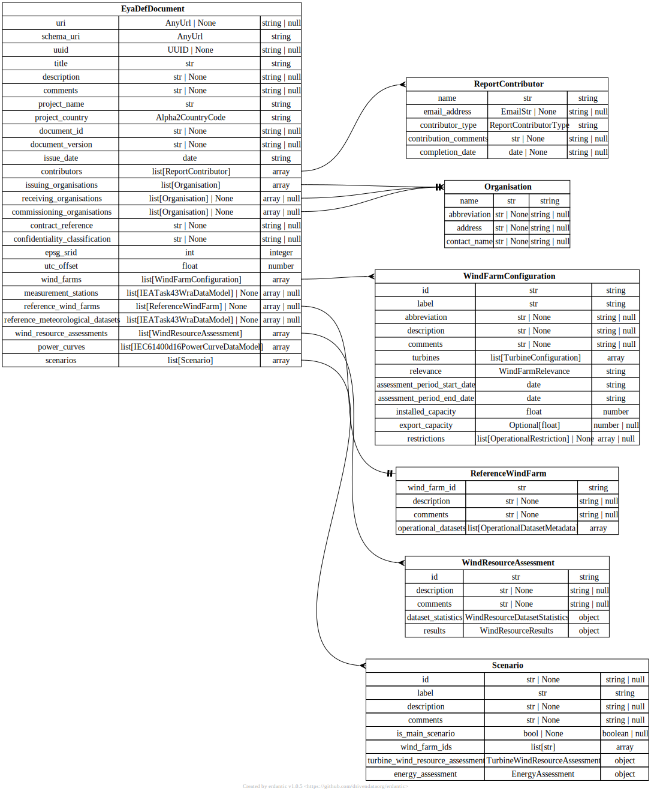

# The IEC 61400-15-2 EYA DEF
[](
https://github.com/IEC-61400-15/eya_def/actions/workflows/eya-def-tools-python-package.yml)
[](
http://mypy-lang.org/)
[](
https://github.com/psf/black)
[](
https://pycqa.github.io/isort/)
[](
https://github.com/pre-commit/pre-commit)

The IEC 61400-15-2 Wind Energy Yield Assessment Digital Exchange Format
(EYA DEF) defines a complementary format for energy yield assessment
reporting to the main written report, aimed at facilitating automated
solutions for data exchange. It is organised as a deeply nested
hierarchical data model and published in the form of a JSON Schema.
Whereas the written EYA report provides an effective narrative for a
human reader, the EYA DEF provides the clear definitions of namespace,
structure and format required for computer systems to exchange energy
yield assessment data. It provides a standard protocol for data
exchange, so that producers and consumers of the data have a common and
clear definition of the data structure and meaning of data fields. The
JSON Schema also facilitates data validation, so that the receiver of
EYA DEF data automatically can validate that the data is fully compliant
with the data model specification.

This repo provides all source data files for the EYA DEF, along with
associated material and tools, as well as serving as the platform for
development work.

This README file only briefly covers some key topics for convenient
reference. Full details will be provided at a separate documentation
site, which still needs to be developed.

## Status

Please note that the EYA DEF is currently in *draft* status and will be
subject to extension and modification. Some elements are currently
incomplete. Please see the issues page for details of open items.

We welcome new people to get involved in the development work.

## Aims and use cases

The EYA DEF aims to facilitate the following:
- data sharing with a wider range of stakeholders in an automated
  fashion;
- securing of data traceability and accuracy;
- integration with systems that process EYA data, such as financial
  model software;
- comparison of EYA results from different parties, for example from
  different third-party consultants; and
- automated generation of reporting tables.

For example, if a project developer receives EYA DEF JSON documents from
its independent consultants, the data can immediately be loaded into the
relevant internal databases and applications, and the results compared
between the different consultants and with internal findings. Then the
developer can share the EYA DEF JSON documents with lenders, investors
and any other financial institutions who require the information to
evaluate the project. They in turn will all be able to pull the data
they need into the relevant applications without the requirement for any
manual data processing. The same goes for other project stakeholders who
require EYA reporting data.

It is also expected that the EYA DEF data models will provide a helpful
reference for companies developing energy yield assessment software.
Whilst the data models used internally in such software of course do not
need to mirror the EYA DEF in order to be able to export results in EYA
DEF format, the EYA DEF data models may in some circumstances prove
useful and avoid the need for completely new designs of data models.

## The EYA DEF JSON Schema

The latest version of EYA DEF JSON Schema is available here [here](
json_schema/iec_61400-15-2_eya_def.schema.json). The JSON Schema is the
primary definition of the EYA DEF data model.

## Example EYA DEF JSON documents

Examples of JSON document files that implement (comply with) the JSON
Schema are found [here](json_schema/examples).

## Python package

This repo includes the Python package [eya_def_tools](eya_def_tools),
which provides a convenient interface for working with the EYA DEF data
model in a Python environment. It has a separate README file, which is
located [here](eya_def_tools/README.md).

## Schema diagrams

The Python package (see [below](#Python-package)) uses [erdantic](
https://erdantic.drivendata.org/stable/) to generate graphical
representations of the `pydantic` data model. Note that the data types
shown in the diagrams are the Python types defined in the `pydantic`
data model and not the JSON Schema types.

The top levels of the current draft of the data model is illustrated
below.

  

## Basic example of format

The text below shows an example of a small subset of energy yield
assessment reporting data from a title page, in unstructured form.

```
Barefoot Wind Farm EYA

Document ID.: 12345678, version B
7th of October 2023

Confidential
Prepared for Miranda Investments Limited
```

The equivalent data is represented in structured EYA DEF JSON format
below. Each piece of information appears together with a standard field
name.

```json
{
 "confidentiality_classification": "Confidential",
 "document_id": "12345678",
 "document_version": "B",
 "issue_date": "2023-10-07",
 "project_name": "Barefoot Wind Farm",
 "receiving_organisations": [
    {
      "abbreviation": "Miranda",
      "address": "9 Acosta St., Republic of Miranda",
      "contact_name": "Luis Bunuel",
      "name": "Miranda Investments Limited"
    }
  ],
 "title": "Barefoot Wind Farm EYA",
}
```

## Data security and integrity

The EYA DEF specification and toolset in this repo covers the schema
content and imposes no requirements with regards to technology for data
transmission and storage, or protocols for digital signatures and
encryption. In the simplest form of data exchange, an EYA DEF document
may simply be transmitted as a JSON text data file attached to an email
together with the main written report. It is however expected that
secure APIs for EYA DEF documents will be developed to automate the data
exchange process and provide comprehensive functionality to ensure data
security and integrity. The user of this standard should adopt
appropriate best practices to ensure data security and integrity in
transmission and storage of EYA DEF data. Adherence to such best
practices will minimise the risk for data manipulation or unauthorised
access. It is recommended that encoding and compression of the data be
specified at the point of access (for example in the API specification).

## Developer guidance

For guidance related to tools and processes for development work, see
the [Python package README](eya_def_tools/README.md). The Python package
forms an integral part of the development workflow.

## Acknowledgements

The EYA DEF has been developed with contributions from the following
people: Christian Jonsson, Stephen Holleran, Jason Fields, Charlie
Plumley, Alina Brenneke, Philippe Beaucage, Mark Stoelinga, Andrew
Henderson, Mark Kelly, Steve Clark, Thomas van Delft, Craig Robinson,
Lars Levermann, Jan Heinen, Nikolaos Simisiroglou, Andres Blanco, Jonny
Crease, Roy Spence and Demetrios Zigras.
